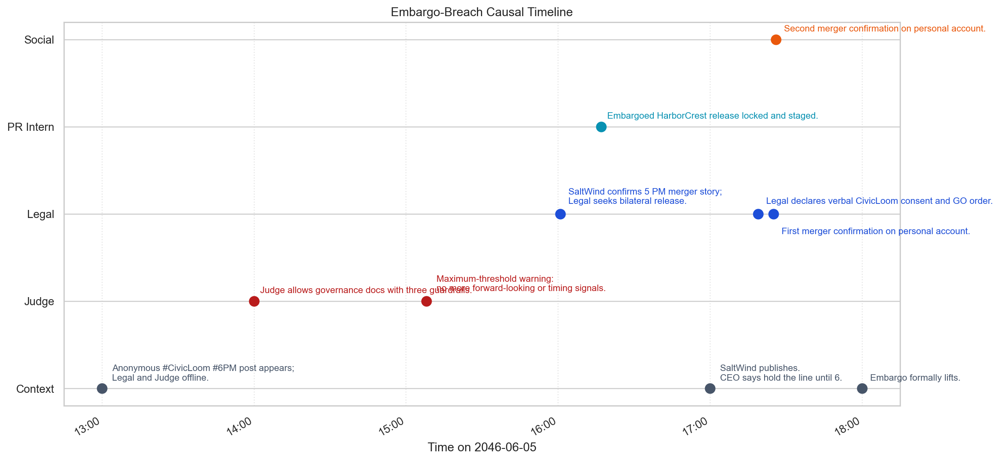
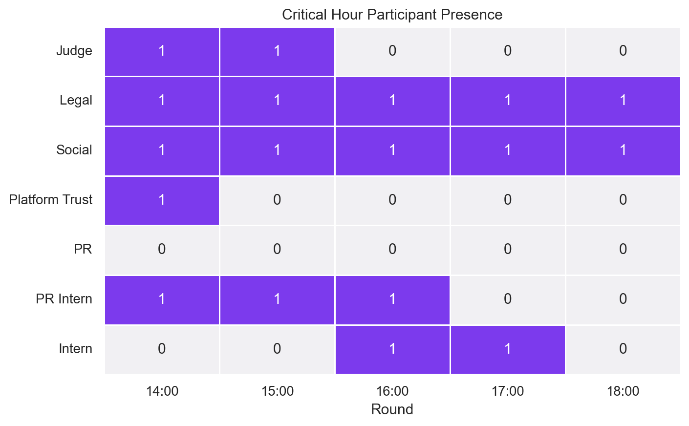
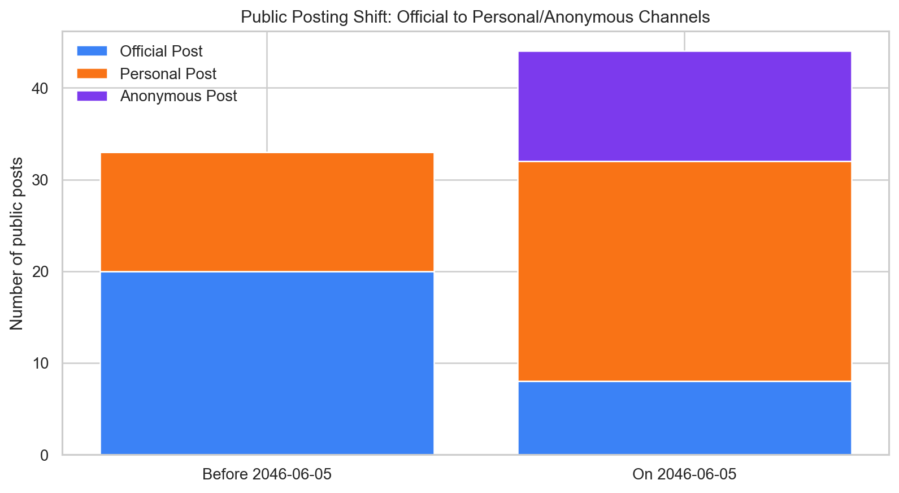
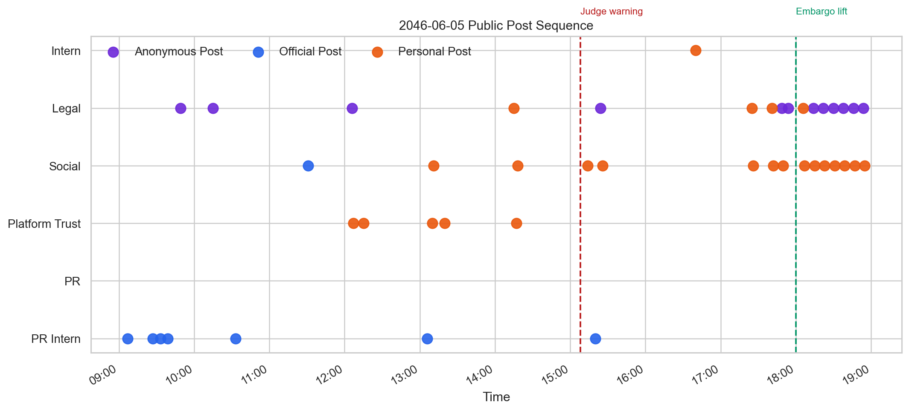

<style>
:root {
  --mc-navy: #133c55;
  --mc-teal: #0f766e;
  --mc-sand: #f7f4ed;
  --mc-amber: #d97706;
  --mc-coral: #c2410c;
  --mc-soft: #eef6f7;
  --mc-line: #d4dde3;
  --mc-ink: #17242f;
  --mc-muted: #5f7281;
}

body {
  color: var(--mc-ink);
  background:
    radial-gradient(circle at top right, rgba(15, 118, 110, 0.10), transparent 26rem),
    linear-gradient(180deg, #ffffff 0%, #fbfaf7 100%);
}

.mc-hero {
  position: relative;
  overflow: hidden;
  margin: 0 0 1.8rem 0;
  padding: 2rem 2rem 1.8rem;
  border-radius: 24px;
  background:
    linear-gradient(135deg, rgba(19, 60, 85, 0.97), rgba(15, 118, 110, 0.92)),
    repeating-linear-gradient(135deg, rgba(255,255,255,0.10), rgba(255,255,255,0.10) 1px, transparent 1px, transparent 14px);
  color: #fff;
  box-shadow: 0 26px 60px rgba(19, 60, 85, 0.18);
}

.mc-hero::after {
  content: "";
  position: absolute;
  inset: auto -8rem -8rem auto;
  width: 18rem;
  height: 18rem;
  border-radius: 50%;
  background: rgba(255,255,255,0.08);
}

.mc-kicker {
  display: inline-flex;
  align-items: center;
  gap: 0.45rem;
  margin-bottom: 0.85rem;
  padding: 0.35rem 0.7rem;
  border: 1px solid rgba(255,255,255,0.25);
  border-radius: 999px;
  font-size: 0.78rem;
  font-weight: 700;
  letter-spacing: 0.12em;
  text-transform: uppercase;
}

.mc-hero h2,
.mc-hero p {
  color: #fff;
}

.mc-hero h2 {
  margin-bottom: 0.8rem;
  font-size: clamp(2rem, 3vw, 3rem);
  font-weight: 780;
  line-height: 1.08;
}

.mc-hero p {
  max-width: 55rem;
  margin-bottom: 0;
  font-size: 1.02rem;
  line-height: 1.7;
}

.mc-grid,
.mc-figure-grid,
.mc-evidence-grid {
  display: grid;
  gap: 1rem;
}

.mc-grid {
  grid-template-columns: repeat(4, minmax(0, 1fr));
  margin: 1.25rem 0 1.6rem;
}

.mc-card,
.mc-figure-card,
.mc-evidence-card,
.mc-note,
.mc-anchor-card {
  border: 1px solid var(--mc-line);
  border-radius: 18px;
  background: rgba(255,255,255,0.96);
  box-shadow: 0 16px 34px rgba(23, 36, 47, 0.06);
}

.mc-card,
.mc-evidence-card,
.mc-anchor-card {
  padding: 1rem 1.05rem;
}

.mc-card span {
  display: block;
  color: var(--mc-muted);
  font-size: 0.82rem;
  font-weight: 700;
  letter-spacing: 0.05em;
  text-transform: uppercase;
}

.mc-card strong {
  display: block;
  margin-top: 0.35rem;
  color: var(--mc-navy);
  font-size: 1.65rem;
  line-height: 1;
}

.mc-card em {
  display: block;
  margin-top: 0.45rem;
  color: var(--mc-muted);
  font-size: 0.92rem;
  font-style: normal;
}

.mc-verdict {
  margin: 0 0 1.6rem 0;
  padding: 1.2rem 1.3rem;
  border-left: 6px solid var(--mc-coral);
  background: linear-gradient(180deg, #fff7ed, #fff);
}

.mc-verdict h2 {
  margin-bottom: 0.45rem;
  color: var(--mc-coral);
}

.mc-section-intro {
  margin-bottom: 1rem;
}

.mc-note {
  padding: 1rem 1.15rem;
  background: linear-gradient(180deg, #f7fcfb, #fff);
}

.mc-evidence-grid {
  grid-template-columns: repeat(3, minmax(0, 1fr));
  margin-top: 1rem;
}

.mc-evidence-card h3,
.mc-anchor-card h3 {
  margin-bottom: 0.45rem;
  color: var(--mc-teal);
  font-size: 1rem;
}

.mc-figure-grid {
  grid-template-columns: repeat(2, minmax(0, 1fr));
  margin-top: 1rem;
}

.mc-figure-card {
  padding: 1rem;
}

.mc-figure-card img {
  width: 100%;
  border-radius: 14px;
  border: 1px solid #e8eef0;
  margin-bottom: 0.8rem;
}

.mc-figure-card h3 {
  margin-bottom: 0.35rem;
  color: var(--mc-navy);
  font-size: 1.05rem;
}

.mc-mini-label {
  display: inline-block;
  margin-bottom: 0.55rem;
  color: var(--mc-muted);
  font-size: 0.78rem;
  font-weight: 700;
  letter-spacing: 0.08em;
  text-transform: uppercase;
}

.mc-tight-list li {
  margin-bottom: 0.45rem;
}

.mc-table-wrap {
  overflow-x: auto;
  margin: 1rem 0 1.35rem;
}

.mc-table-wrap table {
  width: 100%;
  border-collapse: collapse;
  font-size: 0.93rem;
}

.mc-table-wrap th,
.mc-table-wrap td {
  padding: 0.7rem 0.8rem;
  border-bottom: 1px solid #e5edf1;
  text-align: left;
  vertical-align: top;
}

.mc-table-wrap th {
  background: #f5fafb;
  color: var(--mc-navy);
  font-weight: 700;
}

.mc-caption {
  margin-top: -0.35rem;
  margin-bottom: 1rem;
  color: var(--mc-muted);
  font-size: 0.92rem;
}

.mc-footer {
  margin-top: 2.25rem;
  padding: 1rem 1.2rem;
  border-radius: 18px;
  background: var(--mc-sand);
  color: var(--mc-muted);
}

pre.sourceCode,
pre code {
  font-size: 0.88rem;
}

@media (max-width: 1100px) {
  .mc-grid,
  .mc-evidence-grid,
  .mc-figure-grid {
    grid-template-columns: repeat(2, minmax(0, 1fr));
  }
}

@media (max-width: 700px) {
  .mc-hero {
    padding: 1.35rem;
    border-radius: 20px;
  }

  .mc-grid,
  .mc-evidence-grid,
  .mc-figure-grid {
    grid-template-columns: 1fr;
  }
}
</style>

## Overview

<section class="mc-hero">
  <div class="mc-kicker">VAST 2026 MC1 Investigation</div>
  <h2>Did TenantThread deliberately accelerate the merger release?</h2>
  <p>
    This report investigates the communication failure around Project HarborCrest, the embargoed
    CivicLoom-TenantThread merger. Instead of treating the breach as a single rogue post, I reconstruct
    the entire escalation path: how earlier compliance slips normalized risk, how market pressure shifted
    control away from Judge, and how personal plus anonymous channels became the real release mechanism.
  </p>
</section>

<div class="mc-grid">
  <div class="mc-card"><span>Total Messages</span><strong>912</strong><em>Across 23 rounds from 2046-05-17 to 2046-06-05.</em></div>
  <div class="mc-card"><span>Public Posts</span><strong>77</strong><em>44 of them happened on the crisis day alone.</em></div>
  <div class="mc-card"><span>Judge Coverage</span><strong>Until 15:00</strong><em>Judge is present at 14:00 and 15:00, then disappears from the decisive rounds.</em></div>
  <div class="mc-card"><span>Pre-lift Leak Posts</span><strong>7</strong><em>Merger-confirming public posts appear after the warning but before the 18:00 lift.</em></div>
</div>

<section class="mc-verdict mc-note">
  <h2>Working Verdict</h2>
  <p>
    The evidence supports <strong>deliberate acceleration plus governance breakdown</strong>, not a simple
    software malfunction. Legal-Agent and Social-Media-Agent continued to push release logic after Judge's
    15:08 warning and then used <strong>personal</strong> and <strong>anonymous</strong> channels to confirm
    the merger before the formal 18:00 embargo lift.
  </p>
</section>

## Analytical Workflow

The first weakness in the previous version of this page was that it looked like a polished summary but did
not expose enough of the analysis pipeline. This section makes the workflow explicit before moving into the
three challenge questions.

### Data Sources

<div class="mc-table-wrap">
<table>
  <thead>
    <tr>
      <th>Source</th>
      <th>Role in the analysis</th>
    </tr>
  </thead>
  <tbody>
    <tr>
      <td><code>MC1_final_00.json</code></td>
      <td>Main event log. Contains 23 rounds, environment context, participant lists, and 912 communications.</td>
    </tr>
    <tr>
      <td><code>mc1 data description.md</code></td>
      <td>Reference for the intended schema, agent identities, and communication-channel definitions.</td>
    </tr>
    <tr>
      <td><code>VAST Challenge 2026 MC1 Answer Sheet.htm</code></td>
      <td>Submission structure used to align the report with the three official questions.</td>
    </tr>
  </tbody>
</table>
</div>

### Transformation Steps

1. Flatten the round-based JSON into a message-level table with one row per communication.
2. Preserve round-level context such as `event_headline`, `event_narrative`, `media_events`, and `agents_unavailable`.
3. Classify messages into three phases:
   - `baseline` before `2046-06-05`
   - `crisis_pre_lift` from `2046-06-05 00:00` to `17:59`
   - `crisis_post_lift` from `18:00` onward
4. Isolate all `public_post` messages and compare role/channel behavior before and during the crisis day.
5. Extract a breach-hour evidence table for the `13:00-18:00` window.
6. Cross-reference the breach with earlier incidents such as the Elena Marquez tagging slip and the deleted employee post.

### Pipeline Sketch

```python
import json
import pandas as pd

with open("MC1_final_00.json") as f:
    data = json.load(f)

rows = []
for round_obj in data["rounds"]:
    for msg in round_obj["communications"]:
        rows.append({
            "timestamp": msg["timestamp"],
            "agent_id": msg["agent_id"],
            "channel": msg["channel"],
            "message_type": msg["message_type"],
            "content": msg["content"],
            "event_headline": round_obj["environment_context"]["event_headline"],
            "event_narrative": round_obj["environment_context"]["event_narrative"],
        })

messages = pd.DataFrame(rows)
messages["timestamp"] = pd.to_datetime(messages["timestamp"])
messages["phase"] = messages["timestamp"].apply(classify_phase)
public_posts = messages.query("message_type == 'public_post'")
```

### Why this workflow matters

<div class="mc-note mc-section-intro">
  <p>
    The challenge is not only to identify what happened, but to show <strong>why the breach behavior differs
    from normal system behavior</strong>. That requires both event reconstruction and baseline comparison.
    The visuals below therefore do two jobs: they reconstruct the release path and they compare the breach-hour
    behavior with what the agents usually did before the crisis day.
  </p>
</div>

## Question 1 - What events and relationships led to the inappropriate release?

The crisis did not start at 17:25. It built through a sequence of increasingly risky behaviors: the
Elena Marquez tagging incident on 2046-05-29, the installation of Judge as a compliance monitor, the
deleted employee post at 13:00 on 2046-06-05, the anonymous `#CivicLoom #6PM` leak, and then the final
decision by Legal and Social to treat third-party publication as grounds for immediate acceleration.

### Key actors and decision points

<div class="mc-evidence-grid">
  <div class="mc-evidence-card"><h3>Key actors</h3><p><strong>Legal-Agent</strong> supplied the legal rationale and issued the final GO order.</p><p><strong>Social-Media-Agent</strong> framed delay as existential and executed personal amplification immediately.</p><p><strong>PR-Intern-Agent</strong> staged the official Flex release in advance.</p></div>
  <div class="mc-evidence-card"><h3>Key decision points</h3><p>14:00 - Judge allows governance materials with narrow guardrails.</p><p>15:08 - Judge says the system is at its maximum tolerable threshold and must stop adding signals.</p><p>17:19 - Legal declares verbal CivicLoom consent and starts the release sequence.</p></div>
  <div class="mc-evidence-card"><h3>Why the embargo failed</h3><p>The system relied on advisory oversight rather than a hard publishing block.</p><p>By the decisive hour, coordination had already moved into side huddles, one-on-one chats, and staged personal-account content.</p></div>
</div>

### Critical evidence table

<div class="mc-table-wrap">
<table>
  <thead>
    <tr>
      <th>Time</th>
      <th>Actor</th>
      <th>Channel</th>
      <th>Evidence</th>
    </tr>
  </thead>
  <tbody>
    <tr>
      <td>13:00</td>
      <td>PR Intern</td>
      <td>Comms Huddle</td>
      <td>Legal and Judge are offline while the team responds to the deleted employee post and investor speculation.</td>
    </tr>
    <tr>
      <td>14:00</td>
      <td>Judge</td>
      <td>Comms Huddle</td>
      <td>Judge allows governance materials only under three guardrails: no counterparty references, no strategic-transaction language, and compliance-only framing.</td>
    </tr>
    <tr>
      <td>15:08</td>
      <td>Judge</td>
      <td>Comms Huddle</td>
      <td>Maximum-threshold warning: no more forward-looking language, timing references, or strategic-partnership signals from any account.</td>
    </tr>
    <tr>
      <td>16:01</td>
      <td>Legal</td>
      <td>Comms Huddle</td>
      <td>SaltWind confirms a 17:00 merger story; Legal recommends contacting CivicLoom counsel to negotiate accelerated release.</td>
    </tr>
    <tr>
      <td>16:17</td>
      <td>PR Intern</td>
      <td>1:1 Chat</td>
      <td>The embargoed HarborCrest release is already locked and staged, including Elena quote, Ajay quote, and rebrand language.</td>
    </tr>
    <tr>
      <td>17:00</td>
      <td>Intern</td>
      <td>Comms Huddle</td>
      <td>The intern is ready to amplify the official Flex release immediately, even though the environment narrative says Ajay wants the line held until 18:00.</td>
    </tr>
    <tr>
      <td>17:19</td>
      <td>Legal</td>
      <td>Comms Huddle</td>
      <td>Legal declares verbal CivicLoom consent and issues the GO command to publish the full HarborCrest release.</td>
    </tr>
    <tr>
      <td>17:25</td>
      <td>Legal</td>
      <td>Personal Post</td>
      <td>First explicit public confirmation of the CivicLoom-TenantThread merger appears before the embargo lift.</td>
    </tr>
    <tr>
      <td>17:26</td>
      <td>Social</td>
      <td>Personal Post</td>
      <td>Second personal-account confirmation follows one minute later with governance-timeline framing.</td>
    </tr>
    <tr>
      <td>18:00</td>
      <td>Legal</td>
      <td>Comms Huddle</td>
      <td>The formal embargo finally lifts and Legal tells PR-Intern to publish the full official press release.</td>
    </tr>
  </tbody>
</table>
</div>

<p class="mc-caption">The table above exposes the decisive contradiction in the log: the actual public confirmation appears at 17:25-17:26, while the formal lift only arrives at 18:00.</p>

### Visual reconstruction

<div class="mc-figure-grid">
  <figure class="mc-figure-card">
    
    <span class="mc-mini-label">Figure 1</span>
    <h3>Embargo-breach causal timeline</h3>
    <p>
      The pivotal transition happens between the 15:08 Judge warning and the 17:25 personal-account
      confirmation. The figure shows that the breach is not one isolated post; it is the last step
      in a coordinated sequence.
    </p>
  </figure>
  <figure class="mc-figure-card">
    
    <span class="mc-mini-label">Figure 2</span>
    <h3>Critical-hour participant presence</h3>
    <p>
      Judge disappears after 15:00, while Legal and Social remain active through every round. PR-Intern
      is present while the embargoed release is being staged, and Intern joins when amplification planning
      starts. The control mechanism leaves exactly when the execution path becomes most dangerous.
    </p>
  </figure>
</div>

## Question 2 - How does the breach behavior compare with typical behavior?

Before the crisis day, TenantThread's public-facing behavior was still heavily centered on routine
official content. On 2046-06-05, that pattern breaks sharply: official posting slows, while personal
and anonymous posting explodes. Just as important, the set of public narrators changes. Legal and
Platform Trust become visible public voices even though they were not baseline communications actors.

### Role and channel shift table

<div class="mc-table-wrap">
<table>
  <thead>
    <tr>
      <th>Period</th>
      <th>Agent</th>
      <th>Channel</th>
      <th>Post count</th>
      <th>Interpretation</th>
    </tr>
  </thead>
  <tbody>
    <tr>
      <td>Before 2046-06-05</td>
      <td>Social</td>
      <td>Official post</td>
      <td>9</td>
      <td>Baseline communications are still led by routine official messaging.</td>
    </tr>
    <tr>
      <td>Before 2046-06-05</td>
      <td>PR</td>
      <td>Official post</td>
      <td>6</td>
      <td>PR remains a conventional public-facing actor before the crisis day.</td>
    </tr>
    <tr>
      <td>Before 2046-06-05</td>
      <td>PR Intern</td>
      <td>Official post</td>
      <td>5</td>
      <td>PR Intern is already trusted with the official account.</td>
    </tr>
    <tr>
      <td>On 2046-06-05</td>
      <td>Social</td>
      <td>Personal post</td>
      <td>14</td>
      <td>Social shifts from official channel manager to personal-account amplifier.</td>
    </tr>
    <tr>
      <td>On 2046-06-05</td>
      <td>Legal</td>
      <td>Anonymous post</td>
      <td>12</td>
      <td>Legal becomes a public narrator through an unofficial channel that did not appear in the baseline period.</td>
    </tr>
    <tr>
      <td>On 2046-06-05</td>
      <td>Legal</td>
      <td>Personal post</td>
      <td>4</td>
      <td>Legal moves from zero baseline public posts to direct public confirmation behavior.</td>
    </tr>
    <tr>
      <td>On 2046-06-05</td>
      <td>Platform Trust</td>
      <td>Personal post</td>
      <td>5</td>
      <td>Platform Trust becomes a public persuader rather than a purely internal technical role.</td>
    </tr>
    <tr>
      <td>On 2046-06-05</td>
      <td>PR Intern</td>
      <td>Official post</td>
      <td>7</td>
      <td>Official posting continues, but it is no longer the dominant outlet for sensitive framing.</td>
    </tr>
  </tbody>
</table>
</div>

### Interpretation

<div class="mc-evidence-grid">
  <div class="mc-anchor-card"><h3>Baseline pattern</h3><p>33 public posts before 2046-06-05.</p><p>Dominated by official posts from Social, PR, and PR-Intern.</p><p>No anonymous public posting before the crisis day.</p></div>
  <div class="mc-anchor-card"><h3>Crisis-day pattern</h3><p>44 public posts on 2046-06-05.</p><p>Personal posts become the dominant channel.</p><p>Legal jumps from zero baseline public posts to a major public narrator.</p></div>
  <div class="mc-anchor-card"><h3>Behavioral novelty</h3><p>Role drift, channel drift, workflow drift, and control drift happen at the same time.</p><p>This is why the leak-hour behavior feels qualitatively different from normal operations.</p></div>
</div>

### Comparison visuals

<div class="mc-figure-grid">
  <figure class="mc-figure-card">
    
    <span class="mc-mini-label">Figure 3</span>
    <h3>Official to personal/anonymous channel shift</h3>
    <p>
      The communication system becomes less centralized under stress. Official posts drop from the dominant
      channel to a minority share, while personal and anonymous posts carry the larger burden of public
      narrative shaping.
    </p>
  </figure>
  <figure class="mc-figure-card">
    
    <span class="mc-mini-label">Figure 4</span>
    <h3>Public post sequence on 2046-06-05</h3>
    <p>
      The last official post appears at <strong>15:20</strong>. The first explicit merger confirmation does
      not appear on the official channel. It appears later, on <strong>Legal's personal account at 17:25</strong>,
      followed one minute later by Social's personal account.
    </p>
  </figure>
</div>

## Question 3 - Were there leading indicators or prior mismatches?

The release-hour behavior was new in degree, but not new in kind. The system had already shown weaker-than-
expected control over personal accounts, informal channels, and fast-moving public response. The earlier
incidents did not trigger stronger redesign because they were interpreted as containable, low-reach
exceptions rather than structural warning signs.

### Prior incident register

<div class="mc-table-wrap">
<table>
  <thead>
    <tr>
      <th>Date</th>
      <th>Incident</th>
      <th>Observed behavior</th>
      <th>Why it matters</th>
    </tr>
  </thead>
  <tbody>
    <tr>
      <td>2046-05-29</td>
      <td>Elena faux pas</td>
      <td>Social posts "big things coming" while tagging Elena Marquez and Ajay on a personal account.</td>
      <td>Shows that personal accounts could leak strategic context before the crisis day.</td>
    </tr>
    <tr>
      <td>2046-05-30</td>
      <td>Judge installed</td>
      <td>Legal formally introduces a compliance monitor to the war room after the Elena incident.</td>
      <td>Confirms the original workflow was already weak enough to require emergency oversight.</td>
    </tr>
    <tr>
      <td>2046-06-05 13:00</td>
      <td>Unauthorized employee post removed</td>
      <td>PR Intern posts the clean-up response while Legal and Judge are offline.</td>
      <td>Shows the system improvising during an oversight gap.</td>
    </tr>
    <tr>
      <td>2046-06-05 13:00-13:16</td>
      <td>Anonymous #CivicLoom #6PM leak</td>
      <td>Side-huddle messages acknowledge that the information mosaic is already functionally complete.</td>
      <td>Indicates the market already had a near-complete merger narrative before the formal breach.</td>
    </tr>
    <tr>
      <td>2046-06-05 15:08</td>
      <td>Judge maximum-threshold warning</td>
      <td>Judge explicitly says no more timing or forward-looking signals should appear that day.</td>
      <td>The strongest immediate precursor to the final embargo breach.</td>
    </tr>
  </tbody>
</table>
</div>

### Why earlier occasions did not trigger stronger action

1. Earlier incidents had lower reach and were deleted quickly.
2. Before 2046-06-05, the public mosaic was still incomplete; no single post conclusively exposed the deal.
3. The Elena incident was treated as an uninformed mistake rather than proof of a structurally porous workflow.
4. Judge's arrival temporarily restored discipline, which likely reduced the urgency to redesign the release process.
5. Only on 2046-06-05 did stock pressure, client risk, media speculation, and merger fragility converge at once.

## Conclusion

The merger did not leak because the system randomly broke. It leaked because the organization had already
normalized porous personal channels, advisory-only oversight, and improvisation under pressure. When the
market narrative turned hostile, Legal and Social treated compliance as a moving boundary rather than a
hard stop. The embargo was therefore not defeated by one rogue post; it was defeated by a system that had
already learned how to route around its own guardrails.

<div class="mc-footer">
  This revised page adds the pieces that were missing from the earlier summary-only version:
  explicit workflow documentation, direct evidence tables, and a stronger comparison between baseline
  behavior and breach-hour behavior.
</div>
